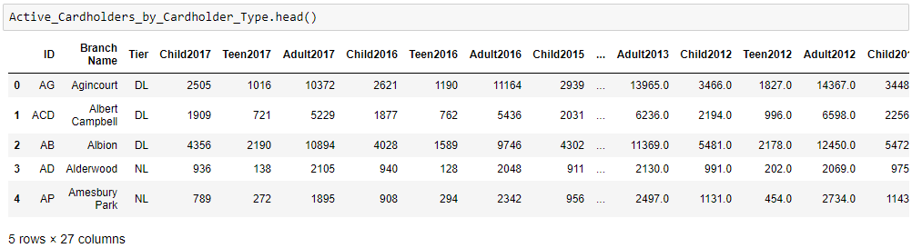
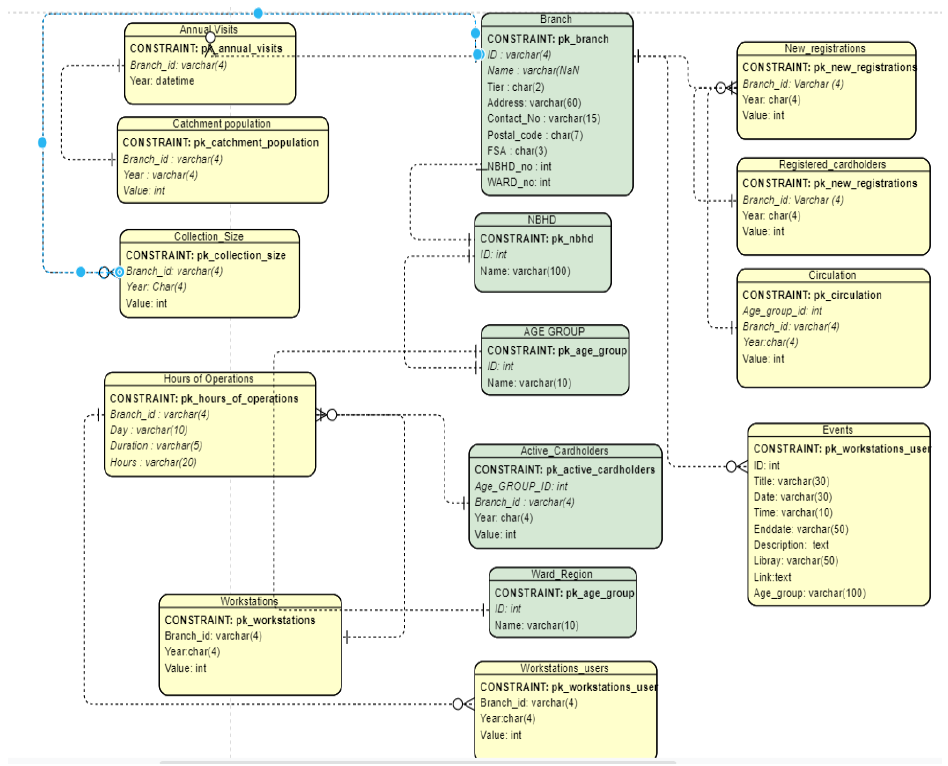
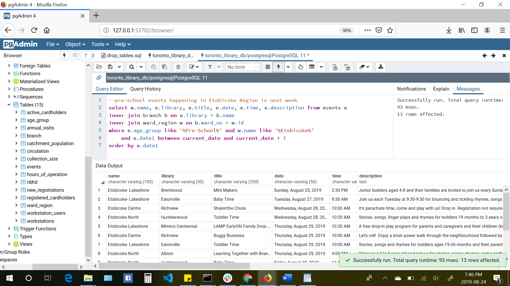
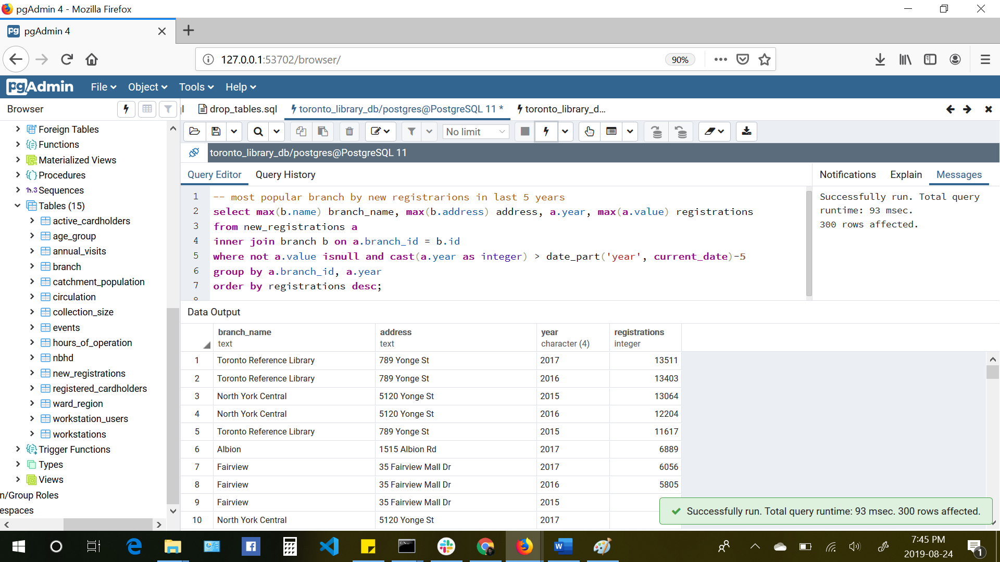
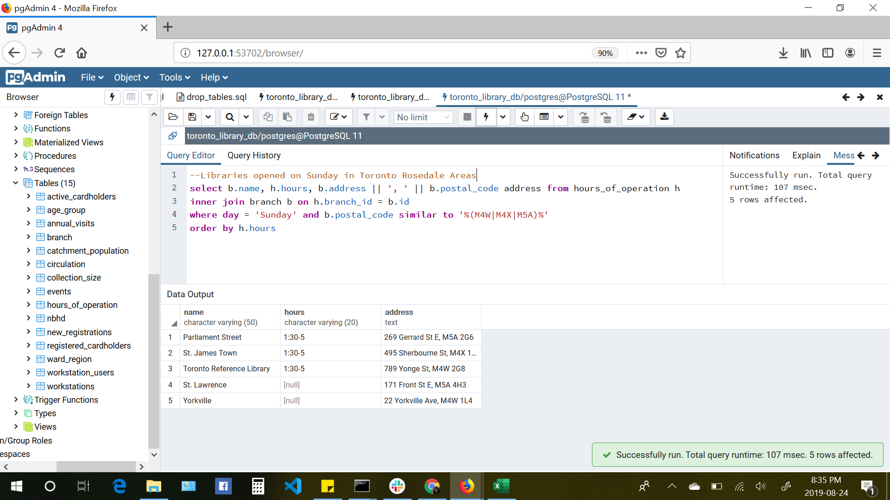

# Week 13 ETL Project
											Dishan Wickremasinghe

The ETL project comprised of Toronto Public Library data, which combined multiple data sources to perform data extraction, normalization and finally transformed them to depict how different branches performed along with their in-house programs offered in the past years.

The primary web source we used was [https://opendata.tpl.ca/](https://opendata.tpl.ca/). This link lead us to some equally interesting data to work with. The data was in different formats like JSON, CSV, KML, and XML.

**1. Data Sets Extracted**

First step for the project was to extract the data. We also used the URL for the list of library branches. Some of the datasets we considered for our project are about active-cardholders, branch information, hours of operation, workstations and new registrations.

Following is the list of the csv files used to build the database.

	a)Active_Cardholders = pd.read_csv(resources/Active_Cardholders.csv)
	b)Active_Cardholders_by_Cardholder_Type = pd.read_csv(resources/Active_Cardholders_by_Cardholder_Type.csv)
	c)Annual_Visits = pd.read_csv(resources/Annual_Visits.csv)
	d)Catchment_Population = pd.read_csv(resources/Catchment_Population.csv)
	e)Collection_Size = pd.read_csv(resources/Collection_Size.csv)
	f)Hours_of_Operation = pd.read_csv(resources/Hours_of_Operation.csv)
	g)New_Registrations = pd.read_csv(resources/New_Registrations.csv)
	h)Registered_Cardholders = pd.read_csv(resources/Registered_Cardholders.csv)
	i)Registered_Cardholders_by_Cardholder_Type = pd.read_csv(resources/Registered_Cardholders_by_Cardholder_Type.csv)
	j)Circulation_by_Cardholder_Type = pd.read_csv(resources/Circulation_by_Cardholder_Type.csv)
	k)Workstations = pd.read_csv(resources/Workstations.csv)
	l)Workstation_Users = pd.read_csv(resources/Workstation_Users.csv)

JSON

	m)Events = https://opendata.tpl.ca/resources/events

**2. Transformation**

The data sets had multiple values so the first step was to normalize the data. Followed by data cleaning with python scripts. I came up with a python code to generate a table of data from the CSV tabular formatted data. 

For example sample of Active Card Holders read from the CSV

**ERD Diagram**

Database is normalized upto 3rd normal fom, and the relationships between parent and child tables are shown in the underneath entity relationship diagram.

**3. Loading: the database**

The final step was to write a script to create the database, tables and relationships. We used SQL alchemy to handle all data input into the PostgreSQL database. This data can be further used to run queries and find out more information about Toronto Public library.

Few queries run against the database are shown below.

	1. Pre-school events happening in Etobicoke Region in next week (Aug-24 to Aug-31)

	2. Branches drew high demand of registration in last 5 years

	3. Libraries open on Sundays in Toronto Rosedale area

**Why we chose this?**

Majority of the data was in CSV format so it seemed like a perfect choice to use relational database to store the final database.

**Additional learning:**

Web scraping with beautiful soup. We tried to use some of the web scraping skills we learned this to get a list of books from the library web page.

[https://www.torontopubliclibrary.ca/books-video-music/new-items.jsp?category=Adult+Fiction](https://www.torontopubliclibrary.ca/books-video-music/new-items.jsp?category=Adult+Fiction)
